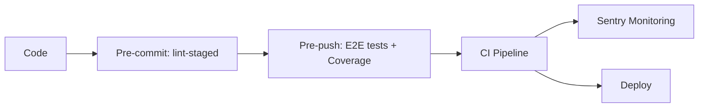

# Svelte Raw Template

A production-ready SvelteKit starter template built with shift-left quality practices. Catch bugs early, ship with confidence.

## Philosophy

This template embraces the **shift-left** methodology—integrating quality gates at every stage of development rather than catching issues in production. Every commit is linted, every push is tested, and every merge is validated through CI/CD.

**Fail fast, fix early.**

## Project Structure

```
sveltekit-production-starter/
  .claude/                    # AI-assisted development config (see below)
  .github/
    workflows/
      main.yml                # CI pipeline: lint, type-check, test, build
  .husky/
    pre-commit                # Runs lint-staged (Prettier + ESLint)
    pre-push                  # Runs full E2E test suite
  e2e/
    _shared/
      fixtures/               # Playwright custom fixtures
      app-fixtures.ts         # App-level fixture composition
    demo.test.ts              # E2E test example
  src/
    lib/
      alerts/                 # Alert/notification utilities
      components/
        ui/                   # Reusable UI components (shadcn-svelte)
      data/                   # Static data / constants
      server/                 # Server-only code (auth, etc.)
      axios.ts                # Configured HTTP client
      env.ts                  # Environment variable access
      utils.ts                # Shared utility functions
    routes/
      pokemons/               # Pokemon listing page
      protected/              # Server-guarded route
      +layout.js              # Root layout config
      +layout.svelte          # Root layout component
      +page.svelte            # Home page
    app.css                   # Global styles (Tailwind)
    app.d.ts                  # App-level type declarations
    app.html                  # HTML shell
    hooks.client.ts           # Client hooks (Sentry)
    hooks.server.ts           # Server hooks (Sentry)
  static/
    favicon.svg               # Site favicon
  CLAUDE.md                   # AI project instructions
  components.json             # shadcn-svelte config
  eslint.config.js            # ESLint configuration
  playwright.config.ts        # Playwright test config
  playwright.monocart-reporter.ts  # Coverage reporter config
  svelte.config.js            # SvelteKit configuration
  tsconfig.json               # TypeScript configuration
  vite.config.ts              # Vite configuration
```

## AI-Assisted Development (`.claude/`)

This project includes a `.claude/` configuration folder that enables **engineering-grade AI assistance** via [Claude Code](https://docs.anthropic.com/en/docs/claude-code). It encodes the project's coding standards, architectural patterns, and workflows so the AI follows the same rules a senior engineer would.

### What It Provides

- **Scoped rules** — Coding conventions activate only on relevant file types (e.g., Svelte standards apply to `*.svelte` files, TypeScript standards to `*.ts` files), so the AI always follows the right patterns in the right context.
- **Custom skills** — Reusable prompts for common workflows (e.g., `plan-feature` generates an engineering checklist before writing code).
- **Post-edit hooks** — Automated ESLint runs after every file edit, catching issues immediately.
- **Project instructions (`CLAUDE.md`)** — A top-level file that gives the AI full context on the architecture, libraries, and quality pipeline.

### `.claude/` Structure

```
.claude/
  rules/
    coding-conventions.md   # Brace style, no inline returns
    svelte-standards.md     # Svelte 5 Runes, SvelteKit patterns, SOLID
    typescript-standards.md # satisfies, type guards, strict rules
  skills/
    plan-feature/
      SKILL.md              # Engineering checklist workflow
  settings.json             # Post-edit hooks, tool permissions
```

### How to Use

1. Install [Claude Code](https://docs.anthropic.com/en/docs/claude-code)
2. Open the project — Claude Code automatically reads `CLAUDE.md` and `.claude/`
3. Ask it to build features, fix bugs, or refactor — it will follow the project's standards

## Quality Gates



| Stage | Trigger | Actions |
|-------|---------|---------|
| Pre-commit | `git commit` | Prettier + ESLint on staged files |
| Pre-push | `git push` | Full Playwright E2E test suite with coverage |
| CI/CD | Push/PR to main | Lint, type-check, test, build |
| Runtime | Production | Sentry error tracking & performance monitoring |

## Technologies

**Core**
- SvelteKit
- TypeScript
- Vite

**Styling**
- Tailwind CSS v4
- Bits UI
- Tailwind Merge & Variants

**Quality**
- ESLint & Prettier
- Playwright (E2E)
- Monocart Reporter (V8 Code Coverage)
- Husky (Git hooks)
- lint-staged

**Observability**
- Sentry (Error tracking & Performance monitoring)

**Validation**
- Zod
- Superforms

**HTTP**
- Axios

## Getting Started

Install dependencies:

```bash
pnpm install
```

Start the development server:

```bash
pnpm dev
```

Build for production:

```bash
pnpm build
```

Preview the production build:

```bash
pnpm preview
```

## Commands

| Command | Description |
|---------|-------------|
| `pnpm dev` | Start development server |
| `pnpm build` | Build for production |
| `pnpm preview` | Preview production build |
| `pnpm check` | Run type checks |
| `pnpm lint` | Lint and check formatting |
| `pnpm format` | Format code with Prettier |
| `pnpm test` | Run E2E tests |
| `pnpm test:show-report` | Open Monocart test report |
| `pnpm coverage:show-report` | Open V8 coverage report |

## Code Coverage

E2E tests collect V8 code coverage using Playwright's built-in coverage API and Monocart Reporter.

**Report Formats**
- V8 HTML Report: `./coverage/e2e/v8/index.html`
- LCOV: `./coverage/e2e/lcov/code-coverage.lcov.info`
- Cobertura XML: `./coverage/e2e/cobertura/code-coverage.cobertura.xml`

## Environment Variables

Create a `.env` file with the following variables:

```
VITE_API_BASE_URL=your-base-api
VITE_SENTRY_DSN=your-sentry-dsn
SENTRY_DSN=your-sentry-dsn
SENTRY_ORG=your-sentry-org
SENTRY_PROJECT=your-sentry-project
SENTRY_AUTH_TOKEN=your-sentry-auth-token
```

## CI/CD Pipeline

GitHub Actions workflow triggers on push and pull requests to main:

1. Install dependencies (pnpm)
2. Run linter and formatter checks
3. Run TypeScript type checks
4. Install Playwright browsers
5. Execute E2E test suite
6. Build the application
